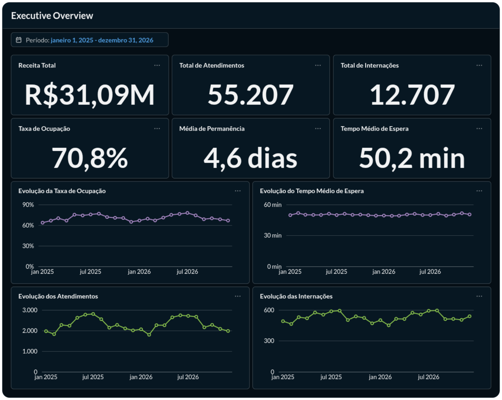
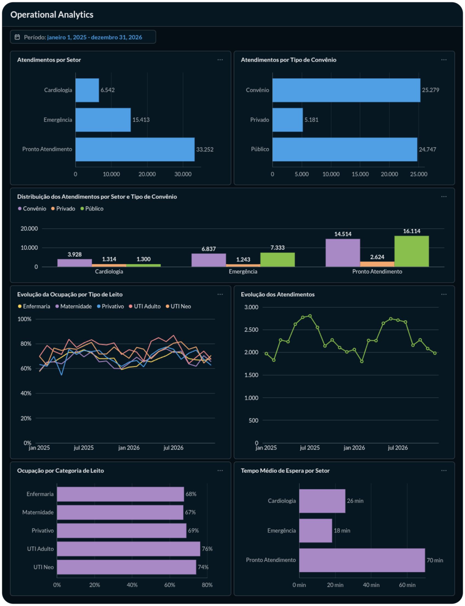
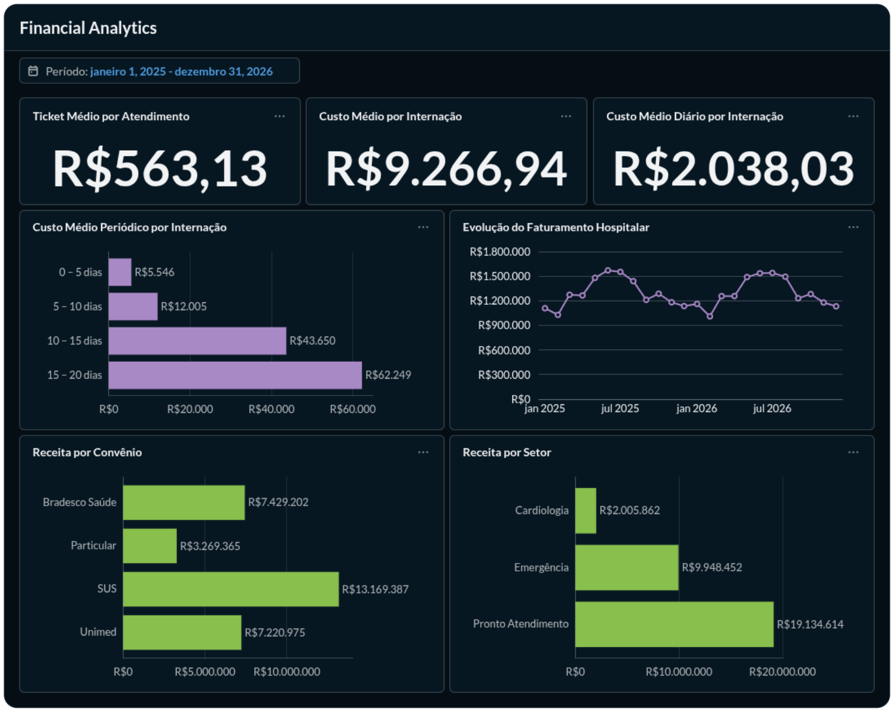
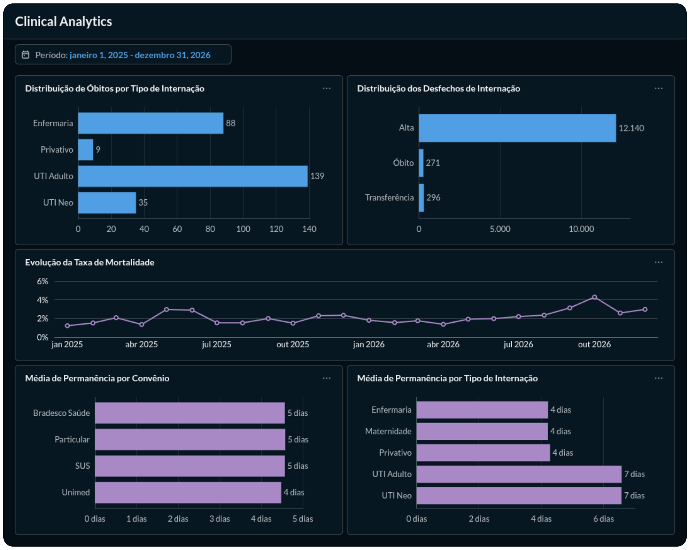

# 🏥 Hospital Analytics Platform & Data Warehouse

[](https://www.python.org/)
[](https://www.mysql.com/)
[](https://www.docker.com/)
[](https://www.metabase.com/)
[]()

Uma plataforma completa de Engenharia de Dados, Modelagem Dimensional e Business Intelligence desenvolvida para monitorar e otimizar os eixos operacional, clínico e financeiro de um hospital geral de médio porte.

O projeto simula um ambiente de produção realista cobrindo um biênio completo (2025–2026), desde a ingestão e modelagem em Data Warehouse até a entrega de painéis analíticos com regras de negócio pré-computadas em SQL.

---

## 📊 Painéis de Inteligência (Metabase BI)

### 1. Executive Overview (Visão C-Level)
Visão consolidada da saúde institucional, faturamento e capacidade instalada.


* **Faturamento Acumulado:** R$ 31,09M no biênio analisado.
* **Volume Global:** 55.207 atendimentos ambulatoriais/pronto atendimento e 12.707 internações.
* **Eficiência Geral:** Taxa média de ocupação de **70,8%** com média de permanência geral (ALOS) de **4,6 dias**.

---

### 2. Operational Analytics (Operação, Filas & Leitos)
Monitoramento em tempo real do fluxo de entrada, tempos de fila e saturação de leitos.


* **Gargalo no Pronto Atendimento:** O PA absorve 60,2% do volume com tempo médio de espera de **70 min**, frente a **18 min** da Emergência.
* **Ocupação Crítica em UTI:** Ocupação contínua de leitos de UTI Adulto em **76%**, sinalizando a necessidade de gestão ativa de desospitalização.

---

### 3. Financial Analytics (Custos & Sustentabilidade)
Curva de custos por ciclo de permanência e divisão de receita por fonte pagadora.


* **Custo Não-Linear de Internação:** Pacientes com permanência curta (0–5 dias) custam em média **R$ 5.546**, enquanto internações prolongadas (15–20 dias) disparam para **R$ 62.249** (>11x).
* **Composição de Receita:** O SUS representa a maior fonte individual de receita (**R$ 13,17M**), seguido por Bradesco Saúde (**R$ 7,43M**) e Unimed (**R$ 7,22M**).

---

### 4. Clinical Analytics (Qualidade Assistencial & Desfechos)
Acompanhamento dos desfechos clínicos, mortalidade institucional e perfil de gravidade.


* **Distribuição de Desfechos:** 12.140 altas (95,5%), 296 transferências (2,3%) e 271 óbitos (2,1%).
* **Concentração Crítica:** A UTI Adulto responde por 51,3% dos óbitos institucionais, com tempo de permanência médio de 7 dias.

---

## 🏥 Contexto Hospitalar Modelado

A arquitetura e os dados foram calibrados para refletir a rotina e as restrições físicas de um hospital geral de médio porte:

* **Capacidade Instalada (134 leitos operacionais):**
  * 80 Leitos de Enfermaria
  * 20 Leitos de Maternidade
  * 10 Leitos Privativos
  * 10 Leitos de UTI Adulto
  * 14 Leitos de UTI Neonatal
* **Infraestrutura Cirúrgica e Obstétrica:** 8 salas de Centro Cirúrgico e 4 salas PPP (Pré-parto, Parto e Pós-parto).
* **Portas de Entrada:** Urgência/Emergência 24h e Pronto Atendimento 24h.
* **Especialidades:** Cardiologia, Obstetrícia, Clínica Médica e Cirurgias Eletivas.
* **Fontes Pagadoras:** Mix equilibrado de Saúde Suplementar (Convênios/Particular) e Sistema Único de Saúde (SUS).

---

## 🏗️ Arquitetura da Solução e Engenharia

```
[ Python / Synthetic Generator ] ──> Geração sintética com calibração hospitalar
              │
              ▼
[ Ingestão & Pipeline ETL ]      ──> SQLAlchemy / Pandas / Validações de integridade
              │
              ▼
    [ MySQL 8.0 (Docker) ]        ──> Data Warehouse em Star Schema (Kimball)
              │                       └── Views de Performance Analítica (SQL)
              ▼
      [ Metabase BI ]             ──> Camada de visualização e exploração C-Level
```

### Modelagem Dimensional (Star Schema)
O banco foi estruturado sob metodologia Kimball, desacoplando métricas de evento de métricas de permanência:
* **Fatos:**
  * `fato_atendimentos`: Granularidade no evento de consulta, tempos de triagem, espera e setor de atendimento.
  * `fato_internacoes`: Granularidade no ciclo completo de internação, tempo de permanência (dias), leito e custos acumulados.
* **Dimensões:**
  * `dim_paciente`, `dim_convenio`, `dim_leito`, `dim_setor` e `dim_tempo`.
* **Camada de Agregação (SQL Views):**
  * Todas as métricas principais (`vw_kpi_atendimentos`, `vw_kpi_internacoes`, `vw_ocupacao_hospitalar`, `vw_performance_hospitalar`) foram isoladas em Views SQL. Isso garante desempenho instantâneo no Metabase e desacopla as regras de negócio da ferramenta de BI.

---

## 📁 Estrutura do Repositório

```text
data-project-hospital/
├── dashboard/
│   └── metabase/
│       └── screenshots/            # Imagens dos 4 dashboards em alta resolução
│           ├── 01-executive-overview.png
│           ├── 02-operational-analytics.png
│           ├── 03-financial-analytics.png
│           └── 04-clinical-analytics.png
│
├── data/
│   ├── processed/                  # Dados tratados prontos para carga (.gitkeep)
│   └── raw/                        # Dados gerados brutos (.gitkeep)
│
├── docs/
│   └── docker-compose.yml          # Especificação da infraestrutura em contêineres
│
├── scripts/
│   ├── load/                       # Ingestão orientada ao MySQL
│   ├── synthetic/                  # Geração controlada com regras de negócio
│   ├── transform/                  # Transformação e consolidação dimensional
│   └── main.py                     # Pipeline orquestrador de execução única
│
├── sql/
│   ├── queries/                    # Consultas ad-hoc e validações
│   ├── schemas/                    # DDL de tabelas e constraints (Kimball)
│   ├── seeds/                      # Cargas dimensionais de referência
│   └── views/                      # DDL das views de indicadores analíticos
│
├── .env.example                    # Template de variáveis de ambiente
├── .gitignore                      # Regras de exclusão do Git
├── README.md                       # Documentação técnica do projeto
└── requirements.txt                # Dependências Python travadas
```

---

## 🛠️ Stack Tecnológica

* **Linguagem & Pipeline:** Python 3.10+, Pandas, NumPy, SQLAlchemy, PyMySQL, Faker
* **Data Warehouse:** MySQL 8.0 (Modelagem Star Schema, Window Functions, CTEs e Views)
* **Business Intelligence:** Metabase BI
* **Infraestrutura:** Docker & Linux (Pop!_OS)

---

## 🚀 Como Reproduzir o Projeto Localmente

### Pré-requisitos
* Git
* Docker e Docker Compose instalados
* Python 3.10+ com ambiente virtual (`venv`)

### Passo a Passo

1. **Clonar o repositório:**
```bash
git clone https://github.com/seu-usuario/data-project-hospital.git
cd data-project-hospital
```

2. **Configurar as variáveis de ambiente:**
```bash
cp .env.example .env
```
*(As credenciais padrão do `.env.example` já estão pré-configuradas para execução local imediata).*

3. **Subir os contêineres (MySQL 8 e Metabase):**
```bash
docker compose -f docs/docker-compose.yml --env-file .env up -d
```

4. **Instalar dependências e executar o pipeline:**
```bash
python3 -m venv venv
source venv/bin/activate
pip install -r requirements.txt
python scripts/main.py
```
*O script `main.py` gerará os dados sintéticos, criará as estruturas dimensionais no MySQL, aplicará as views analíticas e executará a carga de ponta a ponta.*

5. **Acessar a camada de BI:**
* Abra no navegador: `http://localhost:3000`
* Conecte o Metabase ao banco utilizando:
  * **Host:** `localhost` (ou `mysql` se configurado em rede de contêiner compartilhada)
  * **Porta:** `3306`
  * **Banco:** `hospital_dw`
  * **Usuário/Senha:** Valores definidos no seu `.env`