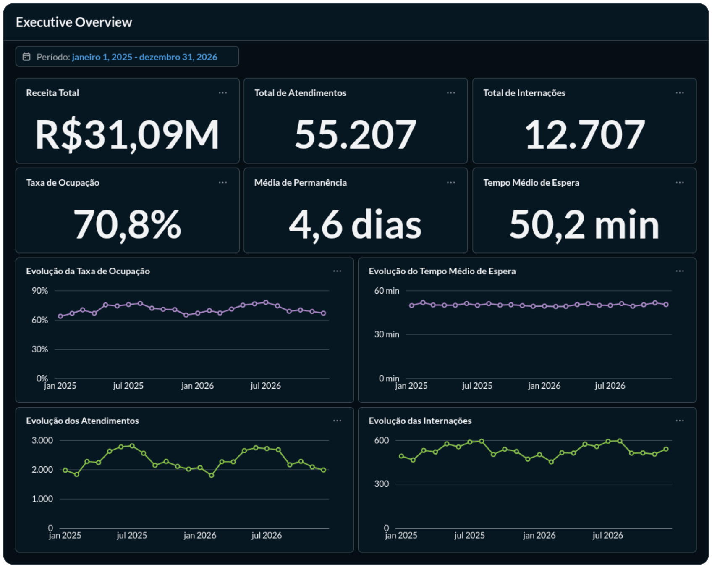
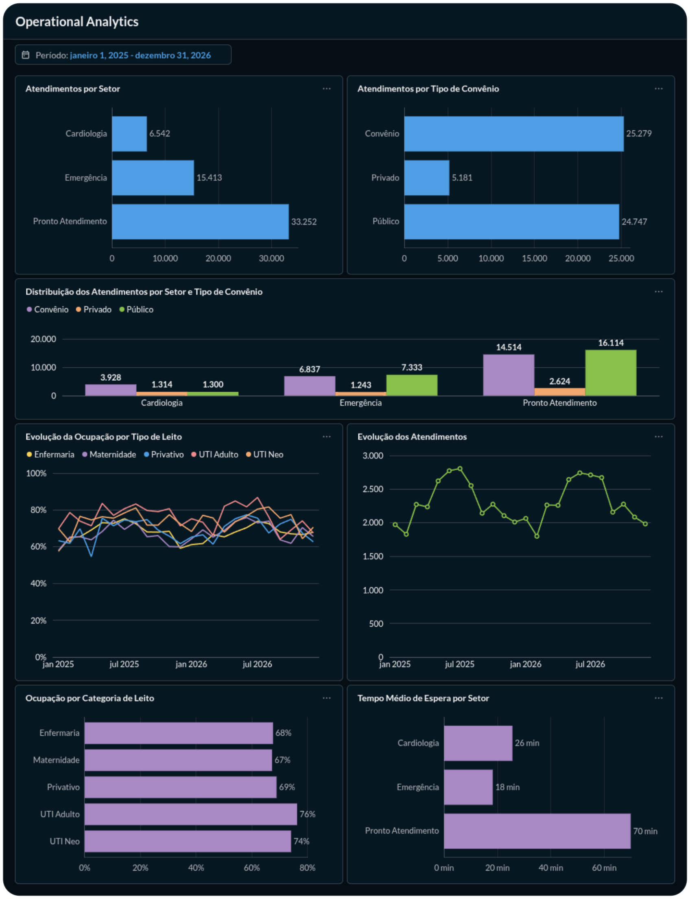
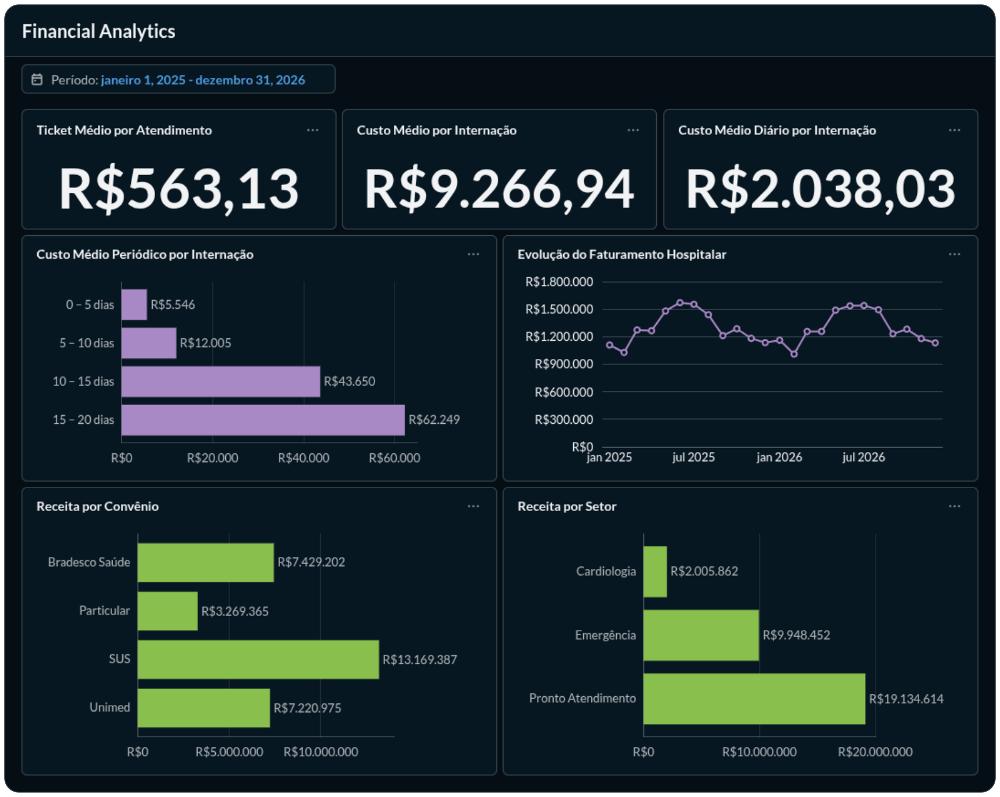
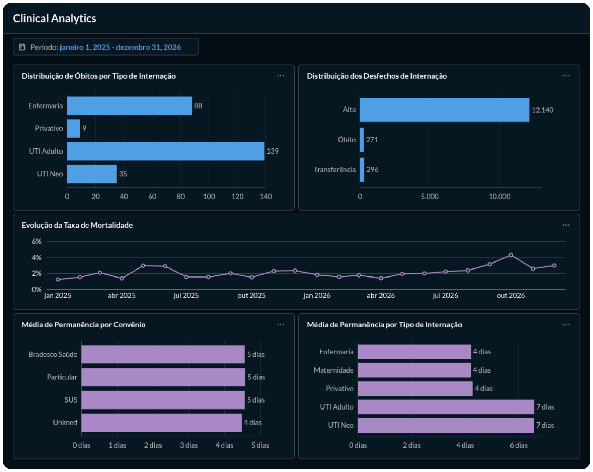

# 🏥 Hospital Analytics Platform & Data Warehouse

[](https://www.python.org/)
[](https://www.mysql.com/)
[](https://www.docker.com/)
[](https://www.metabase.com/)
[]()

Uma plataforma completa de **Engenharia de Dados**, **Modelagem Dimensional** e **Business Intelligence** desenvolvida para monitorar e otimizar os eixos operacional, clínico e financeiro de um hospital geral de médio porte.

O projeto simula um ambiente de produção realista cobrindo um biênio completo (2025–2026), desde a ingestão e modelagem dimensional em Data Warehouse até a entrega de painéis analíticos com regras de negócio pré-computadas em SQL.

---

## 📊 Painéis de Inteligência (Metabase BI)

### 1. Executive Overview (Visão C-Level)
Consolidação da saúde institucional, faturamento e capacidade instalada.

* **Faturamento Acumulado:** R$ 31,09M no biênio analisado.
* **Volume Global:** 55.207 atendimentos ambulatoriais/pronto atendimento e 12.707 internações.
* **Eficiência Geral:** Taxa média de ocupação de **70,8%** com média de permanência geral (ALOS) de **4,6 dias**.

---

### 2. Operational Analytics (Operação, Filas & Leitos)
Monitoramento em tempo real do fluxo de entrada, tempos de fila e saturação de leitos.

* **Gargalo no Pronto Atendimento:** O PA absorve 60,2% do volume com tempo médio de espera de **70 min**, frente a **18 min** da Emergência.
* **Ocupação Crítica em UTI:** Ocupação contínua de leitos de UTI Adulto em **76%**, sinalizando a necessidade de gestão ativa de desospitalização.

---

### 3. Financial Analytics (Custos & Sustentabilidade)
Curva de custos por ciclo de permanência e divisão de receita por fonte pagadora.

* **Custo Não-Linear de Internação:** Pacientes com permanência curta (0–5 dias) custam em média **R$ 5.546**, enquanto internações prolongadas (15–20 dias) disparam para **R$ 62.249** (>11x).
* **Composição de Receita:** O SUS representa a maior fonte individual de receita (**R$ 13,17M**), seguido por Bradesco Saúde (**R$ 7,43M**) e Unimed (**R$ 7,22M**).

---

### 4. Clinical Analytics (Qualidade Assistencial & Desfechos)
Acompanhamento dos desfechos clínicos, mortalidade institucional e perfil de gravidade.

* **Distribuição de Desfechos:** 12.140 altas (95,5%), 296 transferências (2,3%) e 271 óbitos (2,1%).
* **Concentração Crítica:** A UTI Adulto responde por 51,3% dos óbitos institucionais, com tempo de permanência médio de 7 dias.

---

## 🏗️ Arquitetura da Solução

```text
[ Python / Faker / NumPy ]       ──> Simulação de dados hospitalares calibrados
              │
              ▼
[ Ingestão & Pipeline ETL ]      ──> Orquestrador com SQLAlchemy e Pandas
              │
              ▼
    [ MySQL 8.0 (Docker) ]        ──> Data Warehouse em Star Schema (Kimball)
              │                       └── Views de Performance Analítica (SQL)
              ▼
      [ Metabase BI ]             ──> Visualização provisionada (Application DB: MySQL)
```

### Modelagem Dimensional (Star Schema)
O banco foi estruturado sob metodologia Kimball, desacoplando consultas pontuais de internações prolongadas:
* **Fatos:**
  * `fato_atendimentos`: Granularidade no evento de consulta, tempos de triagem, espera e setor.
  * `fato_internacoes`: Granularidade no ciclo de internação, tempo de permanência (dias), leito e custos.
* **Dimensões:** `dim_paciente`, `dim_convenio`, `dim_leito`, `dim_setor` e `dim_tempo`.
* **Views de Performance:** Cálculos analíticos pré-computados (`vw_kpi_atendimentos`, `vw_kpi_internacoes`, `vw_ocupacao_hospitalar`, `vw_performance_hospitalar`).

---

## 🚀 Guia Rápido de Execução

Projetado para ser executado de forma simples em distribuições Linux (Ubuntu, Pop!_OS, Fedora, Debian), macOS ou Windows (WSL2).

### 1. Clonar e Configurar

```bash
# Clone o repositório
git clone https://github.com/Luimar2/data-project-hospital.git
cd data-project-hospital

# Copie o arquivo de variáveis de ambiente
cp .env.example .env
```
> 💡 O arquivo `.env.example` já traz credenciais pré-configuradas e prontas para uso local.

---

### 2. Subir os Contêineres

```bash
docker compose docker-compose.yml up -d
```

Aguarde alguns segundos até que o MySQL conclua o healthcheck e verifique o status:
```bash
docker compose docker-compose.yml ps
```

---

### 3. Executar o Pipeline de Carga

O pipeline cria as tabelas, carrega as seeds de domínio, gera os dados sintéticos de 2 anos e compila as views analíticas:

```bash
# 1. Criar e ativar o ambiente virtual
python3 -m venv venv
source venv/bin/activate  # No Windows (Git Bash): source venv/Scripts/activate

# 2. Instalar dependências
pip install -r requirements.txt

# 3. Executar a carga completa
python scripts/main.py
```

---

### 4. Acessar os Painéis Analíticos

Abra o navegador em: **`http://localhost:3000`**

Utilize as credenciais pré-configuradas:
* **E-mail:** `analyst@hospital.local`
* **Senha:** `hospital123`

*(As 4 dashboards, coleções e perguntas já estarão carregadas e sincronizadas).*

---

## 🛠️ Resolução de Problemas Comuns (Troubleshooting)

<details>
<summary><b>1. Fedora / RHEL / SELinux (Permission Denied nos scripts SQL)</b></summary>

O `docker-compose.yml` deste projeto já utiliza o sufixo `:z` nos volumes compartilhados para permitir acesso com SELinux em modo *Enforcing*. Se por ventura você clonou o repositório com restrições locais de umask e o MySQL acusar `Permission denied`, execute na raiz:
```bash
chmod 644 sql/*.sql
```
</details>

<details>
<summary><b>2. O Metabase abriu na tela de boas-vindas ("Vamos começar")</b></summary>

Isso acontece quando o contêiner do MySQL subiu pela primeira vez antes da montagem correta dos scripts de banco. Limpe os volumes e force a reinicialização:
```bash
docker compose docker-compose.yml down -v
docker compose docker-compose.yml up -d
```
> ⚠️ A flag `-v` remove o volume anterior para permitir que o MySQL processe os scripts em `sql/` do zero.
</details>

<details>
<summary><b>3. Porta 3306 ou 3000 já em uso</b></summary>

Se você já possuir instâncias locais do MySQL ou de outro serviço rodando:
* **Linux:** `sudo systemctl stop mysql`
* Ou altere `MYSQL_PORT` e `MB_PORT` no seu `.env`.
</details>

---

## 📁 Estrutura do Repositório

```text
data-project-hospital/
├── dashboard/
│   └── metabase/
│       └── screenshots/            # Evidências visuais das dashboards
├── data/
│   ├── processed/                  # CSVs tratados gerados pelo pipeline
│   └── raw/                        # Dados brutos intermediários
├── scripts/
│   ├── synthetic/                  # Geradores orientados a regras clínicas/operacionais
│   │    └── db.py                  # Conexão centralizada com retry loop
│   └── main.py                     # Pipeline principal de orquestração e carga
├── sql/
│   ├── init_databases.sql          # Provisiona hospital_dw, metabase_db e permissões
│   ├── metabase_database.sql       # Dump das configurações, perguntas e dashboards
│   ├── schemas/                    # DDL ordenado das tabelas do Data Warehouse
│   ├── seeds/                      # Cargas dimensionais estáticas (setores, convênios)
│   └── views/                      # Métricas de BI pré-computadas em banco
├── venv/
├── .env.example                    # Modelo de variáveis de ambiente
├── docker-compose.yml              # Definição dos containers MySQL 8 e Metabase
├── .gitignore
├── README.md
└── requirements.txt
```